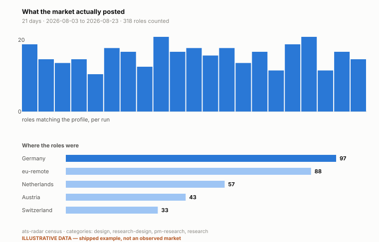

# ats-radar

Poll employers' job boards on a schedule, filter for the roles you actually want,
and get the new ones pushed to Telegram. Nothing about the search is hardcoded — the
roles, the exclusions and the locations all live in a JSON search profile.

Python 3.9+, one dependency (`requests`), runs free on GitHub Actions.

```sh
cp sources.example.json sources.json          # the employers to watch
python3 filters.py profiles/uxr-germany.json  # check the profile behaves
python3 main.py --dry-run                     # see the digest, send nothing
```

---

## What it's actually for

I built this because I had a spreadsheet of target employers in Germany and was
never going to check thirty career pages by hand. But the interesting part turned
out not to be the alerts.

**Running it as a census changed what I thought the market was.**

Five consecutive days of zero matches was the first result — not a bug, a base
rate. Research-only roles in Germany were appearing at roughly zero per day. So I
widened the filter to four tracks and started counting across 112 employers instead
of alerting on 31.

The count said something the target list could not: **the employers actually hiring
user researchers were in neither list.** Not the funded product scale-ups everyone
targets, but classifieds, savings-bank IT, home shopping and retail banking. The
list I had built from reputation was aimed at the wrong segment of the market.

That is the case for `market_census.py` existing alongside the digest. The digest
tells you about the employers you already chose. The census tells you whether you
chose the right ones — and it is the only one of the two that can tell you that you
were wrong.

Two things this method still cannot measure, and I'd rather say so: the
German-language gate on roles that don't state it, and the research-flavoured PM
market, which hides under titles no keyword list catches cleanly.

## Seeing the census

```sh
python3 census_chart.py            # → census.svg
```



The census was already being written to `state/market_history.jsonl` and never looked
at. A run of zeroes is the finding, so the chart marks each zero day rather than
leaving blank paper, and prints the longest run — the thing that distinguishes a base
rate from a broken feed.

`state/` is gitignored, so a fresh clone draws `state/market_history.example.jsonl`
instead and **stamps the figure `ILLUSTRATIVE DATA`**. The example is invented, shaped
like a real run so the chart is inspectable before you have collected anything. A chart
of made-up numbers that does not say so would be the worst thing in this repository, so
it says so on the figure and not only here.

## Search profiles

A profile is the whole search. Swap it and the same code answers a different
question — `profiles/example-minimal.json` is a short one for backend roles in the
Netherlands, there to show the schema without the length of a real list.

```json
{
  "name": "Backend engineering roles in the Netherlands",
  "categories": [
    { "id": "platform", "label": "Platform / Infrastructure", "rank": 0,
      "terms": ["platform engineer", "site reliability", "sre", "devops"] },
    { "id": "backend", "label": "Backend", "rank": 1,
      "terms": ["backend engineer", "api engineer"],
      "patterns": ["\\b(go|python|rust)\\b[\\w /&-]*\\b(engineer|developer)\\b"] }
  ],
  "exclusions": [
    { "name": "junior", "reason": "entry-level and non-permanent formats",
      "terms": ["intern", "werkstudent", "graduate program"] }
  ],
  "locations": {
    "include": ["netherlands", "amsterdam", "rotterdam"],
    "remote": ["remote netherlands", "eu remote"]
  },
  "seniority_pattern": "\\b(senior|staff|lead|principal)\\b"
}
```

**Categories** are tried in order, so you control precedence. `rank` decides the
order roles appear in the digest — best fit first, because a reader scans from the
top and stops.

**`terms`** are plain substrings. **`patterns`** are regexes, for the cases a term
list handles badly: design leadership titles carry no "designer" token at all, so
"Associate Director Experience Design" needs a pattern or it is missed entirely.

**`gate`** handles a category that must be checked before all others. In the UXR
profile, a product manager only counts when the title itself signals discovery
work — so "Product Manager, Discovery" is a PM-research role, "Senior Product
Manager - User Research Platform" is too, and "Senior Product Manager, Payments" is
nothing. A gated category short-circuits: trip the gate and fail its terms, and the
title is rejected rather than falling through to a looser rule.

**`exclusions`** are named, so a rejection can be explained rather than just
happening. The UXR profile has two: entry-level formats (which exist in volume at
large employers and would swamp any digest), and off-domain uses of the same words
— "research scientist", "chip design", "market research" are not what you meant.

Everything is matched after case-folding, accent-stripping and ß→ss, because job
boards are inconsistent about all three and a missed match looks exactly like an
absent posting.

### Test your profile

```sh
python3 filters.py profiles/uxr-germany.json
```

Cases live in `tests/cases.<profile>.json`. Every case in the shipped set was a real
miscategorisation at some point — a "Senior Product Manager, Insights - Vendor"
that got through, a vibration-mechanics researcher, a design-leadership title that
was silently dropped. **Run it after any profile edit.** It is much easier to widen
a term list than to notice what the widening let in.

## Adding an employer

Add an entry to `sources.json` using the fields in `sources.example.json`, then:

```sh
python3 resolve_sources.py    # prints non-empty candidate boards
python3 main.py --audit       # per-source fetched / in-scope / matching table
```

**Do not treat HTTP 200 as proof a board slug is correct.** Two things cost me real
debugging time and will cost you the same:

- **SmartRecruiters returns 200 with `totalFound: 0`** for a company slug that does
  not exist. It looks exactly like an employer with no openings.
- **Greenhouse boards can exist as near-empty stubs.** One target's board was live,
  correct, and had exactly one job on it — which is indistinguishable from a broken
  filter until you look.

So `--audit` separates a *hard* failure (the fetch raised) from a *soft* one (200
with zero jobs), and the health counters track consecutive failures per source. A
feed that has returned nothing for a week is reported in the digest, because silent
sources are how a radar quietly stops working.

Employers with no machine-readable board get `"adapter": "manual"` and are named in
the weekly recap so you check them by hand.

Adapters live in `fetchers.py`: Greenhouse, SmartRecruiters, Ashby, Workday,
Personio XML, RSS. Each source is isolated — one broken feed records one failure
rather than killing the run.

## Notifications

The digest goes to Telegram, reading `TELEGRAM_BOT_TOKEN` and `TELEGRAM_CHAT_ID`
from the environment, or from repository secrets under GitHub Actions. Messages are
chunked to Telegram's 4096-character limit.

**State is saved only after a successful send.** A failed notification re-reports
tomorrow rather than being silently swallowed — the failure mode of a job alert
that loses a posting is much worse than one that repeats itself.

`state/seen.json` is the dedup memory, pruned at 30 days. Delete it and the next
successful run reports every currently open role again.

## Files

| | |
|---|---|
| `main.py` | the daily poll → filter → dedup → notify run |
| `filters.py` | the profile engine, and the profile self-check |
| `regions.py` | bucketing a location into a region code, for the census |
| `fetchers.py` | one function per ATS |
| `digest.py` | Telegram rendering and chunking |
| `market_census.py` | the wide count, appended to `state/market_history.jsonl` |
| `resolve_sources.py` | board-slug discovery |
| `profiles/` | search profiles and the region map |

`sources.json`, `census_sources.json` and `state/` are gitignored. Your target list
and your collected history are yours.

## Options

```
--dry-run              print the digest; send nothing, write nothing
--audit                per-source diagnostics table
--only ID              poll a single source (repeatable)
--force-sunday         exercise the weekly recap
--profile PATH         search profile (default profiles/uxr-germany.json)
```

---

Built by [Himanshu Kalra](https://uxrhimanshu.com). MIT licensed.
